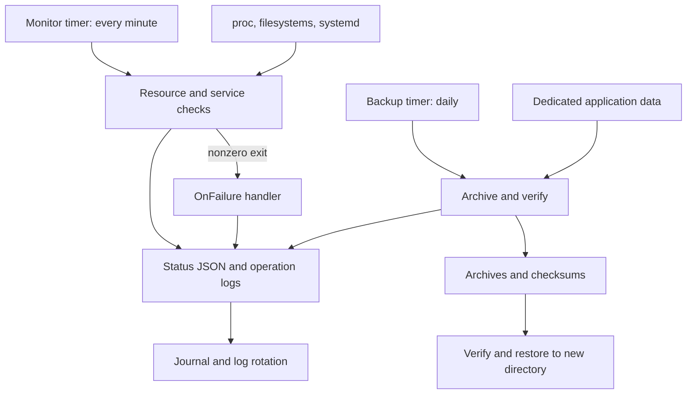

# Linux Server Administration & Monitoring Lab

[](https://github.com/hritiksah00/server-health-monitor/actions/workflows/shellcheck.yml)

A Linux operations project built by extending the original Bash health monitor. It combines resource and service checks, a dedicated service account, permissions, `systemd` scheduling, structured logs, rotation, verified backups, restore recovery, and an SSH/UFW administration lab.

**Run it locally without an AWS account.** Full installation targets a disposable Ubuntu 24.04 VM with systemd. The project uses Python's standard library, Bash, and standard Ubuntu packages.

[Architecture](docs/architecture.md) · [SSH and firewall lab](docs/access-and-firewall.md) · [Troubleshooting and recovery](docs/runbook.md) · [Captured terminal evidence](docs/evidence/local-validation.txt) · [CI runs](https://github.com/hritiksah00/server-health-monitor/actions)

## Capabilities and evidence

| Area | Implementation | Verification |
| --- | --- | --- |
| CPU / RAM / disk | Counter deltas from `/proc/stat`, `MemAvailable`, filesystem usage; configurable thresholds | Real local measurements plus boundary/error tests |
| Services | Explicit systemd units, with active, missing, failed, and query-error handling | A real fixture service is stopped and recovered in CI |
| Users and groups | Non-login `linux-admin` account; optional existing operator added to its read-access group | CI checks identities and allowed/denied file access |
| Permissions | Root-owned code/config; service-owned state/logs/backups; restrictive modes and umask | CI checks ownership, modes, and write boundaries |
| Scheduling | Monitor every minute; daily backup with missed-run catch-up | CI runs actual units and observes a timer-triggered check |
| Logs and alerts | JSON Lines, journal output, latest status snapshot, `OnFailure` handler | CI triggers and verifies a real failure notification |
| Log rotation | Daily rotation, 14 archives, compression, 5 MB size trigger | CI forces rotation and verifies subsequent writes |
| Automatic backups | Verified tar.gz + SHA-256, overlap lock, seven valid copies retained | Backup/restore round trip and corruption/retention tests |
| SSH | Public-key-only drop-in, root/password login disabled | An isolated loopback sshd verifies key login and password rejection in CI |
| UFW | Restricted management SSH rule, deny incoming, allow outgoing, logging | Real UFW dry-run in CI; applying policy is a separate VM exercise |

This is a documented administration lab. The UFW policy is **not enabled on the CI host**, and the installer does not change SSH or firewall settings. On-host packet-filter enforcement still needs the VM exercise in the access guide.

## Architecture



Both scheduled jobs run as `linux-admin`. Installation is the privileged step; routine checks and backups run without root. [Read the design decisions and permission table.](docs/architecture.md)

## Try the project without installing services

For an existing clone, update your clean `main` branch first. For a new clone:

```bash
git clone https://github.com/hritiksah00/server-health-monitor.git
cd server-health-monitor
python3 linux_admin.py --config config/local.json validate-config
python3 linux_admin.py --config config/local.json backup
bash health_check.sh
python3 linux_admin.py --config config/local.json report
```

Local mode creates runtime files under `.local/` and backs up only `examples/data/`. No sudo is needed. Its service list is empty, so it does not pretend to validate systemd inside a container.

A monitor exit code of `1` means attention is needed, such as a resource at its threshold or an overdue backup. The report explains each check.

## Install on a disposable Ubuntu VM

Use an Ubuntu VM that you can access through its console. CI tests Ubuntu 24.04; installation on other distributions/releases has not been verified.

```bash
sudo apt-get update
sudo apt-get install --yes python3 logrotate openssh-server ufw
bash scripts/install.sh
sudo bash scripts/install.sh --apply --operator "$(id -un)"
```

Run the last command from your normal sudo-capable VM account. The operator option adds that existing account to the lab's read-access group; it does not grant sudo. Log out and in again to refresh group membership.

The installer creates the first verified backup before enabling the timers. Re-running it updates project code and units while preserving `/etc/linux-admin/config.json` and existing data.

```bash
systemctl list-timers 'linux-admin-*' --all
sudo -u linux-admin /usr/local/bin/linux-admin report
sudo journalctl -u linux-admin-monitor.service -n 20 --no-pager
```

The sample data is in `/srv/linux-admin/data/service-notes.txt`. Add your own lab documents with appropriate ownership:

```bash
sudo install -o root -g linux-admin -m 0640 /path/to/document.txt /srv/linux-admin/data/document.txt
sudo systemctl start linux-admin-backup.service
```

[Configure and validate SSH keys and UFW separately.](docs/access-and-firewall.md)

## Configuration

Edit `/etc/linux-admin/config.json` using `sudoedit`, then validate it:

```bash
sudoedit /etc/linux-admin/config.json
sudo -u linux-admin /usr/local/bin/linux-admin validate-config
sudo systemctl start linux-admin-monitor.service
```

| Setting | Default | Meaning |
| --- | --- | --- |
| CPU / memory / disk thresholds | 85% | Warning at or above the threshold |
| `sample_seconds` | 1 | CPU counter sampling interval |
| `disk_paths` | `/`, `/var/backups` | Filesystems to inspect |
| `services` | `systemd-journald.service` | Only units the host is expected to keep active |
| `backup_source` | `/srv/linux-admin/data` | Dedicated, readable lab data directory |
| `keep_backups` | 7 | Number of valid completed archives to keep |
| `max_backup_bytes` | 100 MiB | Uncompressed source/restore limit |
| `backup_max_age_hours` | 26 | Warn when the latest completed backup is overdue |

The CPU metric excludes idle and I/O-wait time. RAM usage is `(MemTotal - MemAvailable) / MemTotal`, allowing for reclaimable cache. Filesystem percentages use Python's disk-usage totals and can differ from `df` where reserved blocks affect available space.

JSON is parsed as data, never sourced as shell code. Unknown fields and invalid values fail validation. Add `ssh.service` only when it is expected to remain running; on socket-activated systems an inactive service can be intentional.

If you change storage locations, also update directory permissions and the units' `ReadWritePaths` allowlist. `ProtectHome=true` intentionally makes home directories unsuitable backup sources.

## Verify and restore a backup

Choose a full archive path from:

```bash
sudo ls -lt /var/backups/linux-admin/
```

Replace `ARCHIVE.tar.gz` below with the selected filename. The checksum sidecar must remain beside it.

```bash
sudo -u linux-admin /usr/local/bin/linux-admin verify-backup /var/backups/linux-admin/ARCHIVE.tar.gz
sudo -u linux-admin /usr/local/bin/linux-admin restore /var/backups/linux-admin/ARCHIVE.tar.gz /var/lib/linux-admin/restore-check
sudo diff -r /srv/linux-admin/data /var/lib/linux-admin/restore-check
```

The destination must not exist. Restored files are private to the restoring user; extraction does not apply archived owners or permissions. Inspect recovered data before deliberately copying it back.

Backups are local, unencrypted, and intended for small, trusted, quiescent lab files. They are not database-consistent snapshots or protection against losing the whole disk. Checksums detect corruption; they do not authenticate an archive from an untrusted sender. Corrupt old archives are retained for investigation and do not count toward the valid-backup retention limit.

## Failure handling

| Exit | Meaning | Operational response |
| ---: | --- | --- |
| 0 | Successful operation / healthy check | Read the timestamped result |
| 1 | Resource/service/backup freshness warning | Inspect the failing check |
| 2 | Collection, configuration, I/O, or backup error | Inspect stderr/journal; correct the cause |
| 3 | Another instance holds the operation lock | Let the active operation finish |

Failed scheduled jobs invoke a separate local alert unit. Alerts appear in JSON logs and journald; there is no email/SMS integration. Recovery is deliberate: the project does not kill processes, restart arbitrary services, or alter security settings in response to a warning.

A failed new backup does not trigger retention deletion. Restore validates checksum, paths, member types, and size before extraction. File locks prevent overlapping backups/restores.

## Tests and real output

```bash
python3 -m unittest discover -s tests -v
```

The tests exercise normal resource checks, invalid configuration, command failures/timeouts, threshold boundaries, stale backups, locks, unwritable logs, retention, corruption, traversal/link rejection, and exact data recovery.

The [GitHub Actions workflow](.github/workflows/shellcheck.yml) additionally installs the project on an ephemeral Ubuntu runner and tests actual service identities, systemd execution/timers/failure hooks, rotation, restore, and isolated SSH authentication. Open a run and expand **Exercise installed services on the ephemeral runner** to see its terminal evidence.

[Captured local output](docs/evidence/local-validation.txt) records a real run of the core program and tests. It is explicitly separate from host integration. No screenshots or production metrics are fabricated.

To reproduce host integration yourself, use a fresh disposable VM:

```bash
sudo apt-get install --yes shellcheck logrotate openssh-server ufw
sudo bash tests/integration.sh --disposable-vm
```

That test installs lab files and creates/removes a temporary test account and service. Do not run it on your everyday laptop.

## Operations and troubleshooting

See the [runbook](docs/runbook.md) for stopped-service recovery, a restore drill, log/backup errors, timer debugging, retention, and uninstall steps.

If upgrading the original script, `health_check.sh` now calls the Python monitor. Configure JSON instead of editing Bash constants. Results moved from `server_health.log` to structured logs and a status JSON file. Remove the old monitor cron entry when adopting systemd timers to avoid duplicate scheduling.

## Repository map

| Path | Purpose |
| --- | --- |
| `linux_admin.py` | Monitoring, validated config, logs, backup/verify/restore CLI |
| `health_check.sh` | Familiar entry point for the original project |
| `config/` | Local/server settings, SSH policy, logrotate policy |
| `systemd/` | Monitor, backup, alert units and schedules |
| `scripts/` | Installer and UFW preview/apply helper |
| `tests/` | Failure-path tests and real Ubuntu host integration |
| `docs/` | Architecture, access lab, recovery runbook, captured evidence |
| `examples/data/` | Harmless sample data for backup exercises |

Built as a learning project by Ritik Sah, with AI-assisted implementation and documentation. The repository and CI provide reproducible evidence; installation on a personal VM remains a separate hands-on exercise.
